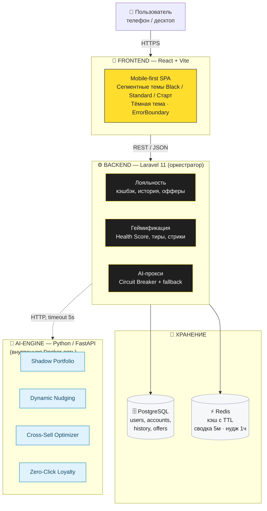

# Архитектура T-Loyalty Hub

## Как это работает простыми словами

1. **Пользователь** открывает приложение в браузере на телефоне или десктопе.
2. **Frontend** показывает интерфейс в стиле Т-Банка и шлёт запросы только в Laravel.
3. **Backend** на Laravel — «дирижёр»: проверяет запрос, идёт в кэш Redis, при необходимости — в PostgreSQL и в AI-Engine, собирает ответ.
4. **PostgreSQL** хранит всё надолго, **Redis** — быстрый кэш на минуты.
5. **AI-Engine** на Python отвечает за все ИИ-фичи. Спрятан во внутренней сети — снаружи к нему не достучаться, только через Laravel.
6. Если AI-Engine падает, Laravel возвращает резервный ответ (Circuit Breaker) — приложение не ломается.

Запуск всей системы — одна команда: `docker-compose up`.
